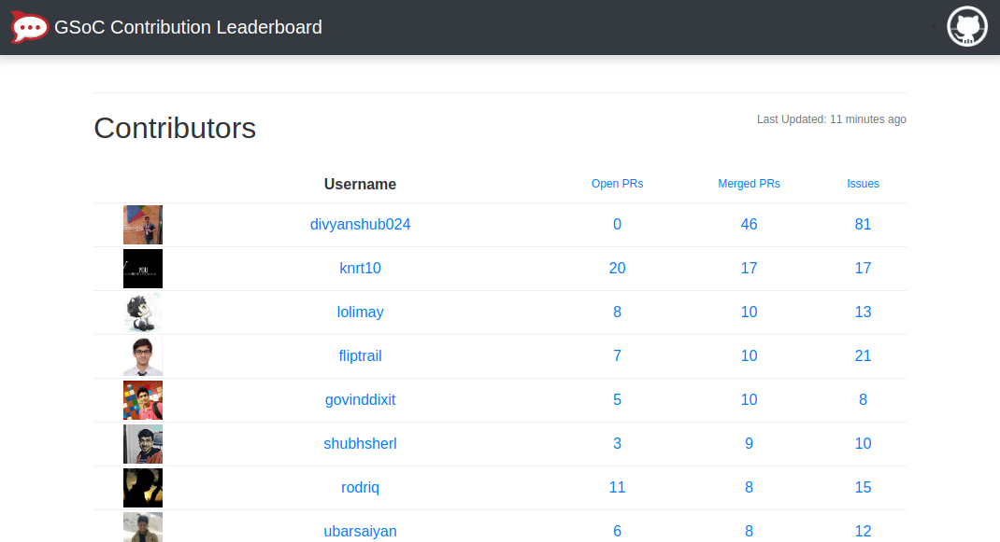

<p align="center"></p>



## Introduction

This is the Node.js implementation of the [GSOC-Contribution-Leaderboard](https://github.com/shubhsherl/GSoC-Contribution-Leaderboard/). The original project cannot count the students' contributions correctly because of its complex inner-mechanism. It's not a good idea that we try to record students' contributions ourselves; the smarter approach is to call the GitHub APIs directly. So I implemented a much more simple and faster one with the same frontend but completely different server service. You can view [this site](https://gsoc.lolimay.cn) for the realtime preview.

### Simple
This new implementation of the [GSOC-Contribution-Leaderboard](https://gsoc.lolimay.cn) is really simple compared to the original one. Its server-side code is within 150 lines only. And It works well with small memory usage.

### Stable
Owning to the new implementation calls the [GitHub APIs](https://developer.github.com/v3/) directly, so it can always fetch the correct contribution information of the students.

### Lightweight
It requires no database or other environments - Only what you need to do is ensuring that your Node.js works well.

## Quick Start
Clone the repository to your local machine and switch into the project root directory:
````bash
git clone git@github.com:lolimay/webpack-scaffold-lolimay.git
cd GSoC-Contribution-Leaderboard-Node
````
Create a file named `config.json` (or rename `config-example.json` to `config.json`) in the base directory. Add your Github Auth Token and Organization name and other keys in it as following:
````bash
{
    "organization": "",
    "organizationHomepage": "",
    "organizationGithubUrl": "",
    "authToken": "",
    "contributors": []
}
````
And then read the [Development](#development) part or [Production](#production) part for the next step.
## Development
````bash
npm install
npm start
````
You will see the GSOC Contribution Leaderboard in the [http://localhost:8080](http://localhost:8080) if all works well. Then open a new terminal window (or tab) and enter the following commands to start your backend service:
````bash
cd src/server
node app.js
````
**Note:** If the backend service is not started, the contributions data will not be refreshed.

## Production
Generate the static files first by running the following command first:
````bash
npm run build
````
Then copy all the files under the `dist` folder into the domain directory on your server. And now you can see the GSOC Contribution Leaderboard by visiting your domain (eg. [https://gsoc.lolimay.cn](https://gsoc.lolimay.cn)). *BUT THIS IS NOT ENOUGH!*

To make backend service run well, please use [pm2](http://pm2.keymetrics.io/) as your Node.js process manager.
````bash
npm install pm2 -g # run this command on your server if pm2 is not installed.
cd <your-domain-directory>/server # switch to the server directory.
pm2 start app.js --name "GSOC-Contribution-Leaderboard" # start the backend service
````
Start your backend service by the above commands on the server so that the data can be always refreshed.

## Acknowledgement
Thanks a lot for the project [GSOC-Contribution-Leaderboard](https://github.com/shubhsherl/GSoC-Contribution-Leaderboard/) which gives me much inspiration to work on it.

## License
This project is open source under the Licence [MIT](./LICENSE).