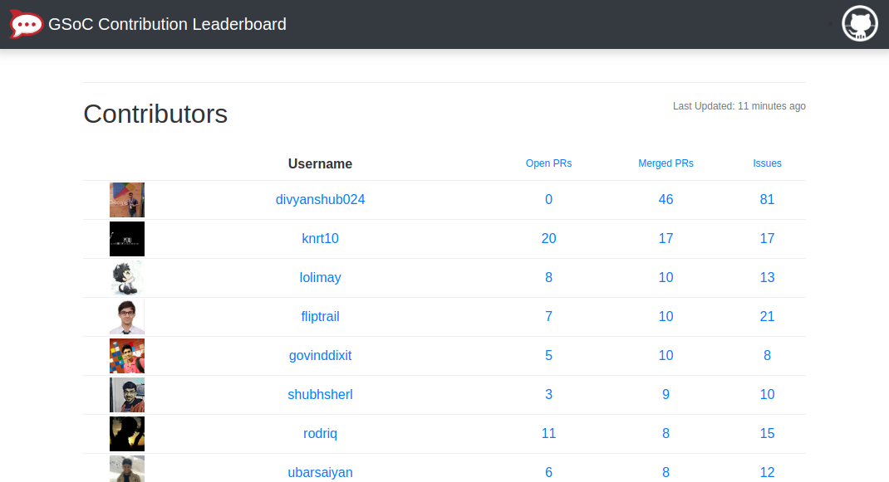

# Opensource Contribution Leaderboard

A real-time leaderboard that tracks open source contributions (PRs and issues) across your GitHub organization. Built with Node.js, Express, and vanilla frontend. 



## What It Does

- Tracks open PRs, merged PRs, and issues per contributor across all repos in a GitHub org
- Updates automatically in the background — no manual refresh needed
- Contributors can be added before they've made their first contribution
- Built-in admin panel for managing the contributor list
- REST API for programmatic access to leaderboard data

## Get It Running (1 minute)

The easiest way to get started. Out of the box, the application runs using a default config and static sample snapshot data from the GSoC 2025 program so you don't even need a GitHub API token to see it in action!

```bash
git clone https://github.com/RocketChat/Opensource-Contribution-Leaderboard.git
cd Opensource-Contribution-Leaderboard
npm run quickstart
```

Open **http://localhost:8080** — you're done.

## Documentation

For more advanced configuration, configuring your own GitHub tokens, or programmatic access, check out our docs:

- [Config Reference](docs/config-reference.md) — How to configure `.env` and `config.json`
- [Local Development](docs/local-development.md) — How to run the frontend and backend separately for hot-reloading
- [REST API](REST-API.md) — Endpoints for extracting leaderboard data programmatically

## How It Works Under the Hood

1. `app.js` starts Express on port 8080 and spawns `refresh.js` as a background process
2. `refresh.js` loops through your `contributors` list, calling the GitHub API for each
3. Results are written to `src/assets/data/data.json` — no database needed
4. The frontend and REST API both read from `data.json`, so they're always in sync
5. Real-time updates are pushed to connected clients via socket.io

## AI Agents & Vibe Coding

This project is set up for AI-assisted development. See:

- [AGENTS.md](AGENTS.md) — context for any AI coding agent (Copilot, Cursor, Windsurf, Cline, etc.)
- [GEMINI.md](GEMINI.md) — context for Google Gemini

These files give AI agents the full project layout, design decisions, and ground rules so they can help without breaking things.

## License
This project is open source under the Licence [MIT](./LICENSE).
